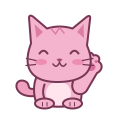

 
# 👋 Hey, ich bin Julia / @edda14

- 🎀 Rosa im Design. Klare Kante im Code.
- 👩‍💻 Frontend-Entwicklerin mit Abschluss.
- 🔍 Ich stelle viele Warum-Fragen. „Weil das halt so ist“ überzeugt mich selten.
- 📚 Bücher, Design & Code. Ich mag Dinge, die eine eigene Handschrift haben.
- 🖤 Eher introvertiert. Trotzdem mit Meinung, Ideen und Lust auf ein gutes Team.
- 🚀 Suche eine Festanstellung im Frontend.
- ⚡ Fun Fact: 1,80 m groß.

### 🛠️ Damit baue ich

### 🐍 Gerade geht’s hinter die Kulissen

Python, Linux und Django lerne ich aktuell berufsbegleitend.

### 📫 Meine Ecke im Internet

[Portfolio](https://julsino.de/) · [Schreib mir](mailto:kontakt@julsino.de)
